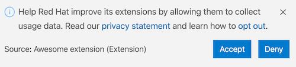

[](https://www.npmjs.com/package/@redhat-developer/vscode-redhat-telemetry)

# Red Hat Telemetry Collection API

This library provides a telemetry collection API for extensions published by Red Hat. **After getting the user's approval, anonymous** [usage data](https://github.com/redhat-developer/vscode-redhat-telemetry/blob/HEAD/USAGE_DATA.md) is collected and sent to Red Hat servers, to help improve our products and services. Read our [privacy statement](https://developers.redhat.com/article/tool-data-collection) to learn more about it.

The first time one of Red Hat's extensions engaging in telemetry collection runs, the user will be asked to opt-in Red Hat's telemetry collection program:



Whether the request is accepted or denied, this pop up will not show again.

It's also possible to opt-in later, by setting the `redhat.telemetry.enabled` user setting to `true`.

From File > Preferences > Settings (On macOS: Code > Preferences > Settings), search for telemetry, and check the `Redhat > Telemetry : Enabled` setting. This will enable sending all telemetry events from Red Hat extensions going forward.


## How to disable telemetry reporting?
If you want to stop sending usage data to Red Hat, you can set the `redhat.telemetry.enabled` user setting to `false`.

From File > Preferences > Settings (On macOS: Code > Preferences > Settings), search for telemetry, and uncheck the `Redhat > Telemetry : Enabled` setting. This will silence all telemetry events from Red Hat extensions going forward.


# How to use this library

## Add the `@redhat-developer/vscode-redhat-telemetry` dependency

In order to install [`@redhat-developer/vscode-redhat-telemetry`](https://github.com/redhat-developer/vscode-redhat-telemetry/) in your VS Code extension, open a terminal and execute:

```
npm i @redhat-developer/vscode-redhat-telemetry
```
## Contribute the `redhat.telemetry.enabled` preference
Unless your extension already depends on a telemetry-enabled Red Hat extension, it needs to declare the `redhat.telemetry.enabled` preference in its package.json, like:

```
"contributes": {
    "configuration": {
      ...
      "properties": {
        ...
        "redhat.telemetry.enabled": {
          "type": "boolean",
          "default": null,
          "markdownDescription": "Enable usage data and errors to be sent to Red Hat servers. Read our [privacy statement](https://developers.redhat.com/article/tool-data-collection).",
          "scope": "window"
        },
      }
    }
}
```
## [Optional] Add a custom segment key in package.json file
By default, extensions will send their data to https://app.segment.com/redhat-devtools/sources/vscode/. In development mode, the data is sent to https://app.segment.com/redhat-devtools/sources/vs_code_tests/.

- You can specify custom segment keys in your package.json, to connect and push usage data to https://segment.com/

```json
    "segmentWriteKey": "your-segment-key-goes-here",
    "segmentWriteKeyDebug": "your-segment-key-goes-here-for-dev-mode",
```

## Add the below code to your `extension.ts`

Get a reference to the RedHatService instance from your VS Code extension's `activate` method in `extension.ts`:
```typescript
import { getRedHatService, TelemetryService } from "@redhat-developer/vscode-redhat-telemetry";

let telemetryService: TelemetryService = null;

export async function activate(context: ExtensionContext) {
  const redhatService = await getRedHatService(context);  
  telemetryService = await redhatService.getTelemetryService();
  telemetryService.sendStartupEvent();
  ...
}
```

Send events from the telemetryService reference:

```typescript
...
if (telemetryService) {
  telemetryService.send({name: "Simplest event"});
  ...
  let event = {
    name: "Test Event",
    type: "track", // optional type (track is the default)
    properties: { // optional custom properties
      foo: "bar", 
    }
  };
  telemetryService.send(event);
}
```

To access the anonymous Red Hat UUID for the current user:
```typescript
const redhatUuid = await (await redhatService.getIdManager()).getRedHatUUID();
```

Once your extension is deactivated, a shutdown event, including the session duration, will automatically be sent on its behalf. However, shutdown event delivery is not guaranteed, in case VS Code is faster to exit than to send those last events.

All event properties are automatically sanitized to anonymize all paths (best effort) and references to the username.


## Publicly document your data collection

Once telemetry is in place, you need to document the extent of the telemetry collection performed by your extension.
* add a USAGE_DATA.md page to your extension's repository, listing the type of data being collected by your extension.
* add a `Data and Telemetry` paragraph at the end of your extension's README file:
> `The ***** extension collects anonymous [usage data](USAGE_DATA.md) and sends it to Red Hat servers to help improve our products and services. Read our [privacy statement](https://developers.redhat.com/article/tool-data-collection) to learn more. This extension respects the `redhat.elemetry.enabled` setting which you can learn more about at https://github.com/redhat-developer/vscode-redhat-telemetry#how-to-disable-telemetry-reporting`

* add a reference to your telemetry documentation page to this repository's own [USAGE_DATA.md](https://github.com/redhat-developer/vscode-redhat-telemetry/blob/HEAD/USAGE_DATA.md#other-extensions).

### Turn on logging during development
In your `.vscode/launch.json`, set the `VSCODE_REDHAT_TELEMETRY_DEBUG` environment variable to `true`:
```json
{
  "name": "Run Extension",
  "type": "extensionHost",
  "request": "launch",
  "args": [
    "--extensionDevelopmentPath=${workspaceFolder}"
  ],
  "outFiles": [
    "${workspaceFolder}/dist/**/*.js"
  ],
  "preLaunchTask": "${defaultBuildTask}",
  "env": {
    "VSCODE_REDHAT_TELEMETRY_DEBUG":"true"
  }
},
```

# How to use from a VS Code webview
From a VS Code webview, since you can not rely on accessing the filesystem, you need to instanciate the `TelemetryService` from a `TelemetryServiceBuilder`, providing browser-specific implementations of services for collecting data. 

To get a reference to the TelemetryService instance for your VS Code extension:
```typescript
import { TelemetryServiceBuilder, TelemetryService, TelemetrySettings, Environment, IdManager } from "@redhat-developer/vscode-redhat-telemetry";
...
const packageJson: any = ...; // an object defining `{publisher:string, name:string, version:string, segmentWriteKey:string}` 
const idManager: IdManager = ...; // a service returning Red Hat anonymous UUID
const environment: Environment = ...; // an object containing environment specific data (OS, locale...)
const settings:TelemetrySettings = ...;  // an object checking whether telemetry collection is enabled
const telemetryService: TelemetryService = new TelemetryServiceBuilder(packageJson)
                                             .setIdManager(idManager) 
                                             .setEnvironment(environment) 
                                             .setSettings(settings)
...
let event = {
    type: "track",
    name: "Test Event",
};
telemetryService.send(event);

//To access the RedHat UUID for the current user:
const REDHAT_UUID = idManager.getRedHatUUID();
```

# Build
In a terminal, execute: 
```
npm i
```
to install the dependencies, then:
```
npm run prepublish
```
to build the library

# Information on data transmission during development

When the extension sending telemetry is running in `development mode`, the data are sent to the `test.vscode` project on https://segment.com/, or whatever project bound to the optional [segmentWriteDebugKey](#optional-add-a-custom-segment-key-in-packagejson-file).
As the transmission is opt-in, unless specifiying it explicitely, no data are transmitted during CI build.
